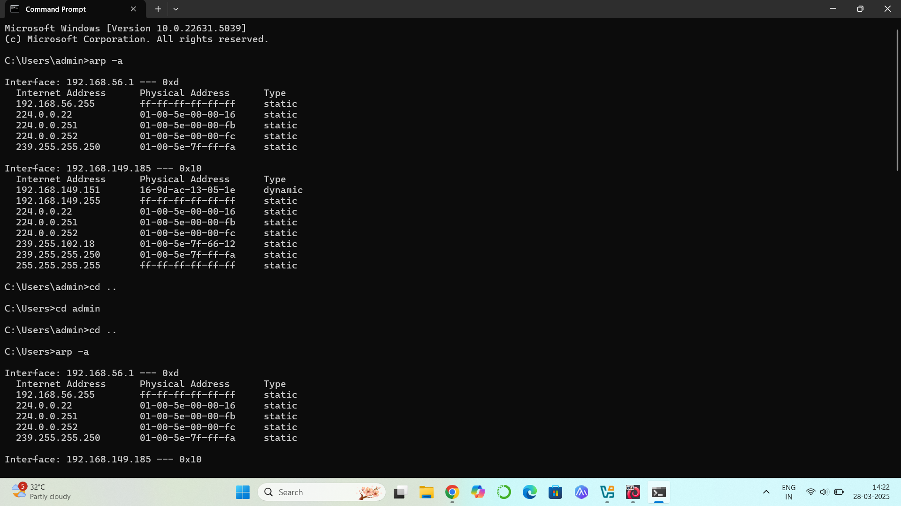
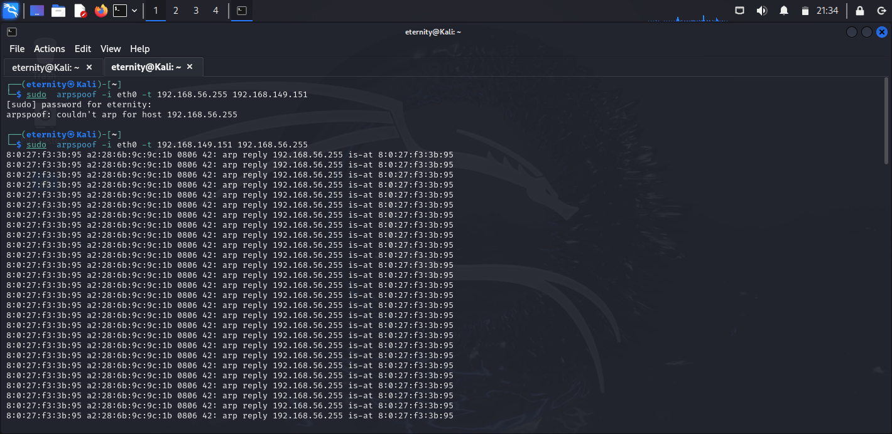
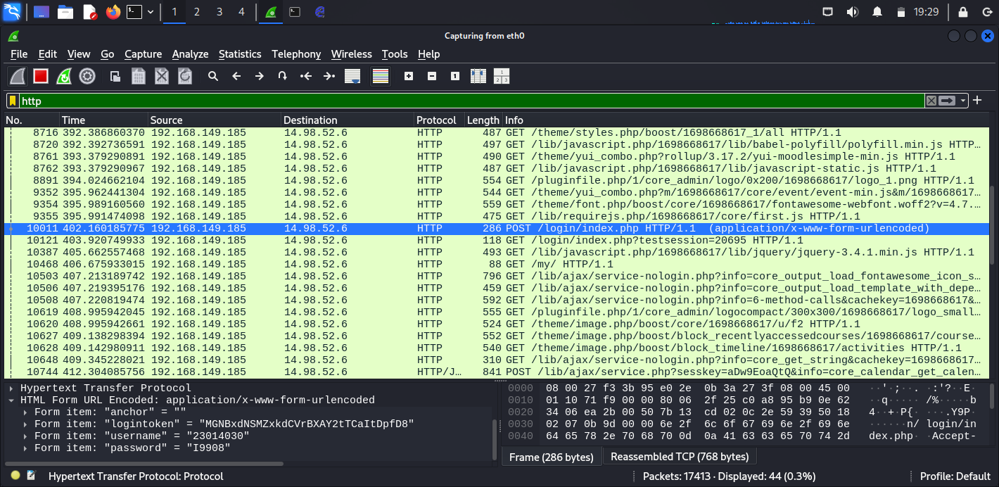
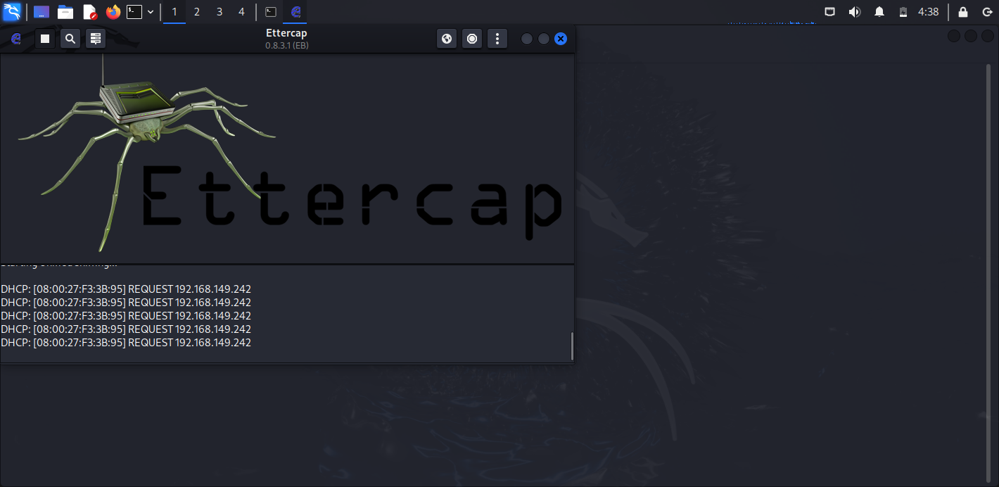

# ARP-Attack-and-Network-Sniffing
# Explore Network Sniffing and ARP Aacks
# AIM:
To explore network sniffing and ARP Aacks
## STEPS:
### Step 1:
Install kali linux either in paron or virtual box or in live mode
### Step 2:
Invesgate on the various categories of tools as follows:
### Step 3:
Open terminal and try execute some kali linux commands
## ARP Aacks:
ARP spoofing: A hacker sends fake ARP packets that link an aacker's MAC address with an IP of a
computer already on the LAN.
Boot kali and Windows7 virtual machines.
In windows 7 give the command arp -a
## OUTPUT:

From kali linux issue the command :
sudo arpspoof -i eth0 -t <target system> -r <gateway>
eth0 should replaced by appropriate interface from iconfig command
## OUTPUT:

Invoke the wireshark and examine the various menus and controls of the tool. Also following shows
how wireshark can be used as sniffing tool.

##Eercap
Eercap supports acve and passive dissecon of many protocols (even encrypted ones) and
includes many feature for network and host analysis.
Eercap can be used as sniffing tool as illustrated below:

## RESULT:
The kali linux tools for ARP Attack and Network Sniffing were identified successfully
